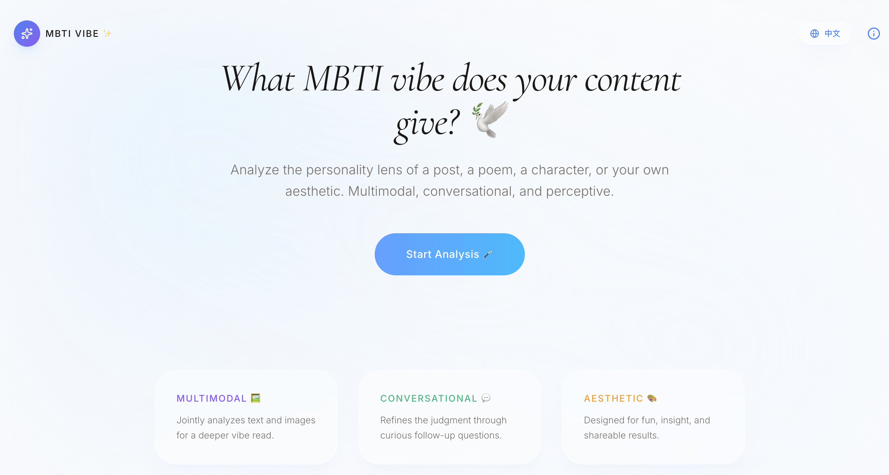
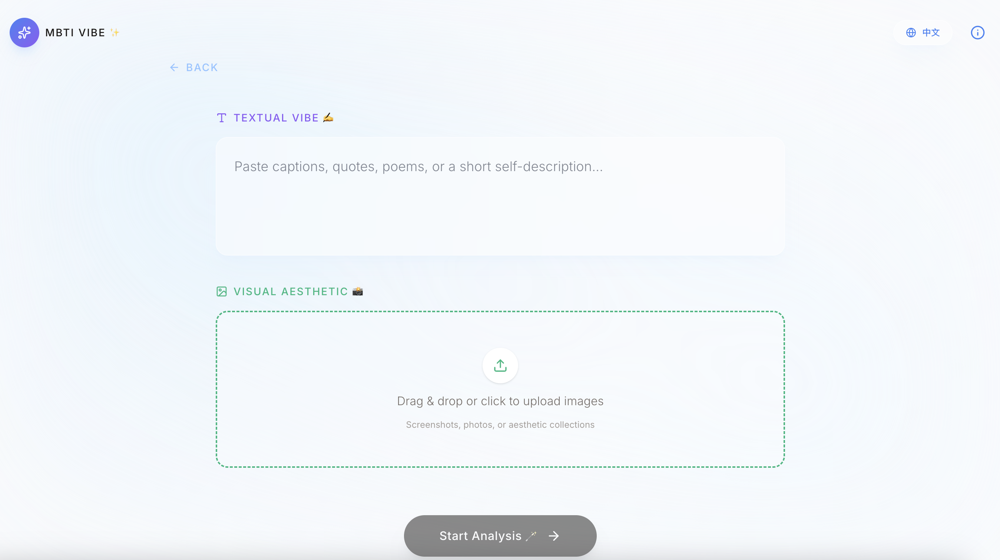
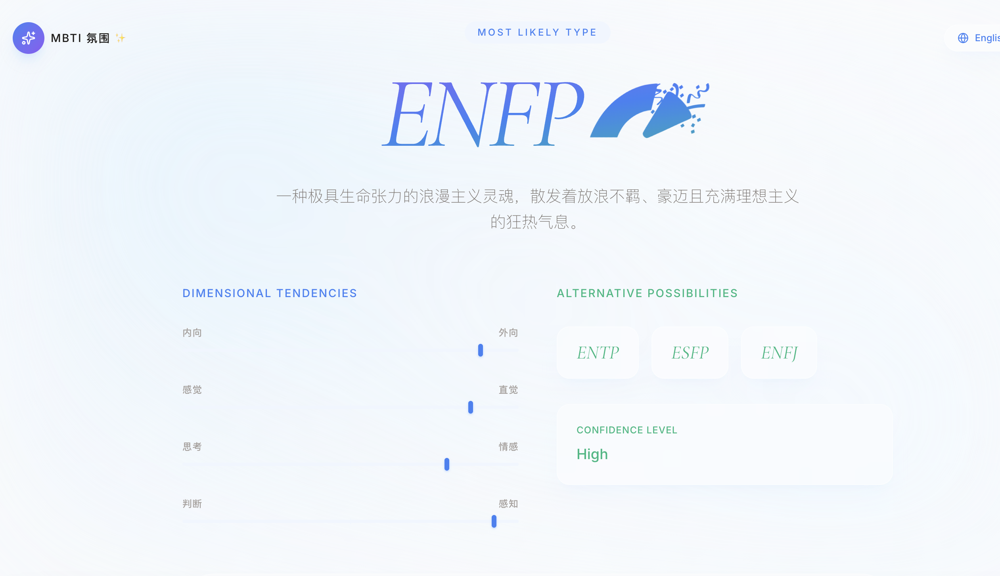
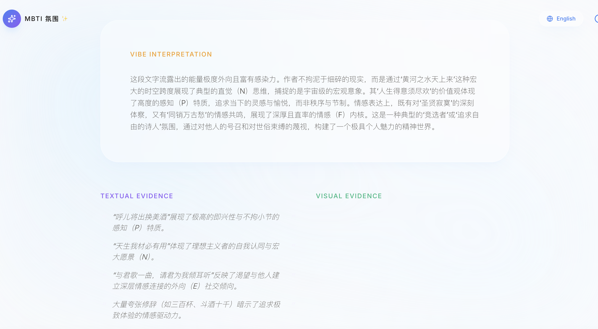

<div align="center">
  
</div>

<h1 align="center">MBTI Vibe</h1>

<p align="center">
  A multimodal AI web app that analyzes text and images to infer the MBTI vibe your content gives.
</p>

<p align="center">
  Multimodal · Conversational · Aesthetic · Shareable
</p>

---

## Overview

**MBTI Vibe** is a conversational multimodal AI app designed to analyze the **personality vibe** expressed through content.

Users can upload or paste:
- captions, quotes, poems, or short self-descriptions
- screenshots, photos, or aesthetic image collections
- or a combination of text and visuals

The app then infers the **most likely MBTI vibe** of the content, explains the reasoning through a structured and narrative analysis, and returns a polished result page.

> **Important:** MBTI Vibe does **not** claim to determine a person's real MBTI type.  
> Instead, it explores **what kind of MBTI atmosphere or expressive energy your content gives off**.

---

## Features

- **Multimodal analysis** of text and images
- **Conversational experience** with follow-up reasoning
- **Structured MBTI-style output** with alternative possibilities
- **Narrative vibe interpretation** of tone, emotion, and aesthetic style
- **Textual and visual evidence** sections
- **Elegant and shareable result pages**

---

## Screenshots

### Home Page


### Input Page


---

## Example Analysis: Li Bai

To demonstrate the app, I tested it on **Li Bai**, one of the most celebrated poets in Chinese literary history.

Li Bai is known for his bold imagination, emotional intensity, cosmic scale, romantic freedom, and unrestrained poetic energy. His verses often move between intoxication, loneliness, transcendence, friendship, moonlight, mountains, and the vastness of the universe. Rather than focusing on restraint or order, his poetry radiates spontaneity, passion, symbolic thinking, and an almost explosive appetite for life.

In this example, **MBTI Vibe** interprets Li Bai's poetic voice as a very典型的 **ENFP vibe**: exuberant, idealistic, emotionally vivid, freedom-loving, and overflowing with imaginative energy.

Again, this does **not** mean Li Bai himself “was definitely ENFP.”  
It means that **the content and expressive aura of his poetry strongly give off an ENFP-like vibe**.

### Result Page


### Interpretation Page


### Evidence Page


---

## What This App Tries to Capture

MBTI Vibe is less like a rigid personality test and more like a **content aura interpreter**.

It asks questions such as:
- Does this writing feel inward or outward?
- Does it sound intuitive, concrete, emotional, or analytical?
- Do the visuals reinforce or complicate the textual tone?
- What kind of personality atmosphere does this content project?

The result is an **MBTI vibe reading**, not a scientific diagnosis.

---

## Run Locally

### Prerequisites
- Node.js

### Setup

1. Install dependencies:

   ```bash
   npm install


